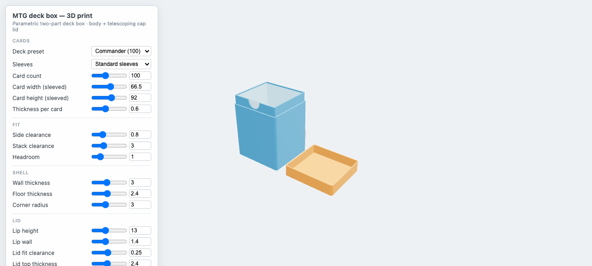

# Parametric MTG deck box — 3D print

A browser-based parametric builder for a two-part Magic: The Gathering deck box: a **body** that
holds a vertical stack of (sleeved) cards and a **telescoping cap lid** that slides over a
reduced-thickness neck and closes flush. Adjust the deck size, sleeve type and fit with live
sliders, preview the exact geometry in 3D, and download print-ready STLs.

**Live:** [jonas-jensen.com/deck-box](https://jonas-jensen.com/deck-box) (embedded from this
repo's GitHub Pages deploy — every push to `main` publishes via `.github/workflows/deploy.yml`,
and the site proxies the live build; no release step).



## Run it

```bash
vp install      # or: pnpm install
vp dev          # http://localhost:5173
vp build        # production build → dist/
vp check        # format + lint + typecheck
pnpm test       # parameter/dimension math tests
```

Run tests through `pnpm test` (the project-local `vp`), not a globally installed `vp`: the tests
import `vite-plus/test` from this project's `node_modules`, and a global runner brings a second
vitest instance that crashes with `Cannot read properties of undefined (reading 'config')`.

## The design

- **Body** — rounded-rect shell, card cavity sized from `cardCount × cardThickness` plus
  clearances **and token headroom** (extra cards' worth of depth, 10 by default — commander
  players' top complaint about "100+" boxes is that 100 double-sleeved cards plus a few tokens
  don't actually fit), and a thinner-walled **lip** (neck) at the top that the lid telescopes over.
- **Retrieval** — three ways to get the deck out, mix to taste: an optional **thumb notch** dipping
  into the lip's front edge (capped at the lip height, so the closed lid always hides it);
  **finger recesses** through the narrow faces that reach slightly below the cavity floor, so you
  grip the cards' long edges Sidewinder-style; and a **push-up hole** through the floor to pop a
  snug stack out with one finger.
- **Lid** — a cap with the same outer footprint as the body. Its socket is the lip plus `lidFit`
  clearance per side; the skirt seats on the body's shoulder for a tight, flush seam. A small
  built-in ceiling slack (0.3 mm) guarantees it seats on the shoulder rather than bottoming out on
  the lip.
- **Closure** — three styles, selectable in the panel:
  - **Friction fit** (default): the socket clearance alone retains the lid; `lidFit` sets how snug.
  - **Snap fit**: a rounded detent ridge across each wide lip face clicks into a matching groove
    inside the lid skirt, right as the lid seats. The round profile is its own cam, so it snaps on
    and off with no lead-in chamfer. _Snap engagement_ is the interference — how hard it clicks.
  - **Magnets**: four slim vertical pillars — two per wide face — carry pockets for glued-in disc
    magnets (Ø3×2 by default; Ø4×2 and Ø6×3 are the other widely sold sizes and fit the sliders
    too), which meet face-to-face right at the seam. The pillars keep the
    magnets clear of the neck, the lid socket and the cards at any wall thickness; at thin walls
    they stand a few mm proud as rounded ribs, and they sink toward flush as the wall grows. Glue
    each pair oriented to attract.
- **Body style** — the walls can stay **solid** or get an opening cut through both wide faces to
  show the cards: an arched **window** (put your commander at the front of the stack and it
  doubles as a showcase — the stack faces the wide walls), a row of vertical **slots**, or a
  **honeycomb** of hexes. One slider scales the opening; solid margins are always kept beside,
  above and below it, and the ring under the shoulder stays intact so the lip loads into full
  wall.
- Cards stand upright: width along X, stack along Y, height up Z. Sleeve presets (unsleeved /
  penny / standard / double-sleeved) set the card dimensions and per-card thickness; deck presets
  set the count (40 / 60 / 75 / 100). Per-card thickness varies by sleeve brand — that slider is
  the one to tune if your 100-card stack measures differently.

## Printing

- Print **both parts as exported, no supports**: the body base-down, the lid top-face-down. Every
  face is a vertical wall or an upward-facing ledge.
- `lidFit` is the print-fit knob: ~0.15 mm is snug, ~0.25 mm suits a well-tuned printer in
  PLA/PETG, ~0.35 mm is an easy fit. Print one lid, test, adjust.
- The readout warns when the derived **lid skirt** (`wall − lipWall − lidFit`) drops below 1 mm —
  keep it at 2–3 perimeters of your nozzle width.
- **Snap fit**: start at 0.3 mm engagement in PLA; drop toward 0.2 if the lid is a fight to open,
  raise toward 0.4 for a harder click (PETG flexes more, so it tolerates more). The ridge and
  groove print cleanly on the vertical walls — still no supports.
- **Magnets**: pockets are cut 0.4 mm over the magnet diameter and 0.3 mm deeper than its height;
  drop the magnets in with a dab of CA glue after printing, alternating polarity so each body/lid
  pair attracts. The pillars rise straight off the bed and the pockets open upward in both parts'
  print orientation — still no supports.
- **Openings**: every cutout profile is self-supporting on a vertical wall — the window's teardrop
  arch tops out at 45°, the slots end in semicircles, and the hexes are point-up — so window,
  slots and honeycomb bodies also print without supports. The finger recesses reuse the teardrop
  profile and the push-up hole is a plain hole in the flat floor, so the retrieval extras don't
  change that.

## How it works

Vanilla TypeScript + Vite+ · Three.js (preview + STL export) · manifold-3d (WASM CSG).

| File                     | Responsibility                                                                                         |
| ------------------------ | ------------------------------------------------------------------------------------------------------ |
| `src/params.ts`          | `Params` type, defaults, sleeve/deck presets, `dims()` derived dimensions — the single source of truth |
| `src/csg.ts`             | manifold-3d layer: WASM init, `scope()` tracked-solid lifetimes, Manifold → BufferGeometry             |
| `src/shapes.ts`          | 2D profiles: rounded rectangle, thumb-notch slot                                                       |
| `src/deckbox.ts`         | `buildBody()` / `buildLid()` — pure `Params → BufferGeometry`, modelled in print orientation           |
| `src/viewer/main.ts`     | App entry: meshes, presets, STL downloads, rAF-coalesced rebuilds                                      |
| `src/viewer/scene.ts`    | Generic Three.js viewer with on-demand rendering                                                       |
| `src/viewer/controls.ts` | Declarative slider table → panel rows, dynamic ceilings                                                |
| `src/viewer/readout.ts`  | Size/capacity/filament readout + printability warnings                                                 |
| `src/viewer/storage.ts`  | Versioned localStorage persistence with a defensive merge                                              |

The preview and the exported STLs come from the same `buildBody()`/`buildLid()` calls
(millimetres, Z-up), so the print matches what you see. Manifold guarantees watertight,
2-manifold output — slicers see clean solids.
